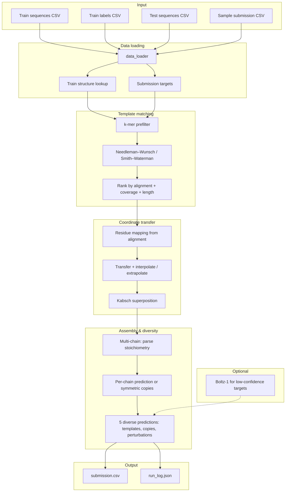

# RNA 3D Folding — Kaggle Competition Solution

Predicts 3D coordinates (C1' atom positions) of RNA molecules from their sequences for the [Stanford RNA 3D Folding Part 2](https://www.kaggle.com/competitions/stanford-rna-3d-folding-2) competition. Evaluation uses **TM-score** (0–1, higher is better) with best-of-5 diverse predictions per target.

---

## Architecture

High-level pipeline: load competition data → two-stage template matching → alignment-guided coordinate transfer with Kabsch superposition → multi-chain assembly → diversity generation → optional Boltz-1 refinement → submission CSV.



**Module overview**

| Component | Role |
|-----------|------|
| `data_loader` | Load train/test CSVs, build structure lookup (all conformational copies), parse submission targets |
| `alignment` | Global (Needleman–Wunsch) and local (Smith–Waterman) sequence alignment; residue mapping |
| `superposition` | Kabsch algorithm for optimal rigid-body superposition; TM-score approximation |
| `template_matcher` | K-mer prefilter → alignment ranking → coordinate transfer with Kabsch → diversity (templates, copies, perturbations) |
| `multichain` | Parse stoichiometry and FASTA; homo-oligomer symmetric copies; hetero-oligomer per-chain then assemble |
| `geometry` | A-form helix generation, coordinate sanitization, resampling |
| `deep_learning` | Optional Boltz-1 CLI integration for de novo prediction |
| `submission` | Build submission CSV, sanity checks, validation against sample |

---

## Approach

**Template-based prediction** with multi-strategy diversity:

1. **Two-stage template search** — K-mer prefilter (5-mers) narrows ~5,700 training structures to top 50; Needleman–Wunsch / Smith–Waterman ranks them by alignment score, coverage, and length similarity.
2. **Alignment-guided transfer** — Residue-level mapping from alignment; smoothing; extrapolation capped with A-form helix where needed.
3. **Kabsch superposition** — Optimal rotation/translation on aligned residues applied to full transferred structure.
4. **Multi-chain assembly** — FASTA per-chain parsing; homo-oligomers: one chain predicted then symmetric copies; hetero-oligomers: per-chain prediction then concatenation.
5. **Diverse predictions** — Five per target from distinct templates, alternate conformational copies, and small perturbations; ordered by quality for best-of-5.
6. **Optional Boltz-1** — Deep learning de novo prediction for targets with poor template scores.

Temporal cutoff filtering ensures only templates with release before the test target’s cutoff are used.

---

## Setup

```bash
pip install -r requirements.txt

# Kaggle credentials
mkdir -p ~/.kaggle
cp kaggle.json ~/.kaggle/kaggle.json
chmod 600 ~/.kaggle/kaggle.json

# Download competition data
export KAGGLE_API_TOKEN=<your-token>
kaggle competitions download -c stanford-rna-3d-folding-2 -f sample_submission.csv -p data
kaggle competitions download -c stanford-rna-3d-folding-2 -f train_sequences.csv -p data
kaggle competitions download -c stanford-rna-3d-folding-2 -f test_sequences.csv -p data
kaggle competitions download -c stanford-rna-3d-folding-2 -f train_labels.csv -p data
```

---

## Running

```bash
# Template-based prediction (~60 seconds)
python run.py --data-dir data --output output/submission.csv

# With Boltz-1 deep learning enhancement (slower; requires `pip install boltz`)
python run.py --data-dir data --output output/submission.csv --use-boltz
```

**Visualization**

```bash
python visualize.py --submission output/submission.csv --output-dir viz
# Open viz/index.html for the dashboard and 3D plots
```

---

## Project structure

```
.
├── run.py                 # Main pipeline
├── visualize.py           # 3D Plotly visualizations and dashboard
├── requirements.txt
├── data/                  # Competition data (downloaded)
│   ├── train_sequences.csv
│   ├── train_labels.csv
│   ├── test_sequences.csv
│   └── sample_submission.csv
├── src/
│   ├── config.py          # Hyperparameters and seed
│   ├── data_loader.py     # Data loading, structure lookup
│   ├── alignment.py       # Needleman–Wunsch, Smith–Waterman
│   ├── superposition.py  # Kabsch, TM-score
│   ├── template_matcher.py # Two-stage matching, transfer, diversity
│   ├── multichain.py      # Stoichiometry, assembly
│   ├── geometry.py        # A-form helix, sanitization
│   ├── deep_learning.py   # Optional Boltz-1
│   └── submission.py      # Submission CSV and validation
└── output/
    ├── submission.csv
    └── run_log.json
```

---

## Data format

**Input (test/train sequences):** `target_id`, `sequence`, `temporal_cutoff`, `description`, `stoichiometry`, `all_sequences`, `ligand_ids`, `ligand_SMILES`

**Output (submission):** `ID`, `resname`, `resid`, `x_1`, `y_1`, `z_1`, …, `x_5`, `y_5`, `z_5` — five C1' xyz predictions per residue.

---

## License

Use and adapt as needed for the competition and learning. Competition terms and Kaggle rules apply.
